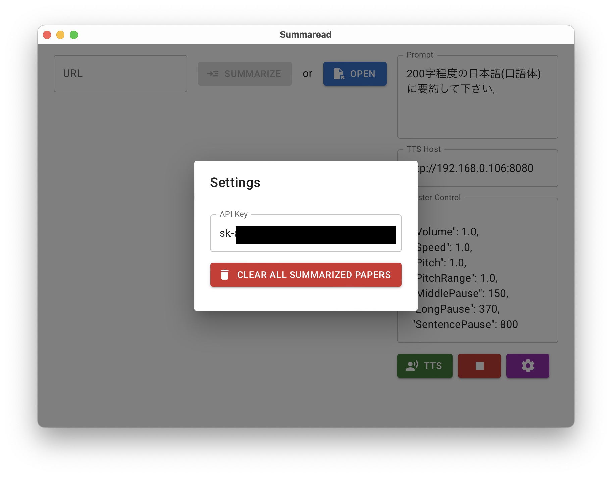

# Summaread

## 使い方

- 画面右下の設定ボタンを押して OpenAI の API トークンを記載する
  
- TTS Host の欄に「AiVoiceHttpApi(現在非公開)」の URL を入力
- URL から PDF を読ませたり，Open ボタンから PDF を開いて要約してもらったら，TTS ボタンで A.I.VOICE による音声合成を行うことができる

## 注意

- Windows だと 1 台の PC で完結するが，macOS の場合は同一 LAN 内に Windows PC を用意する必要あり
- OpenAI の API の課金額に気をつける
